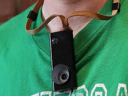

# Autographer-omg-life
Documentation and notes for legacy support for Autographer wearable personal camera by OMG Life.

Autographer is a hands-free, wearable digital camera developed by OMG Life. The camera uses five different sensors to determine when to automatically take photos and can take up to 2,000 pictures a day. It was released in July 2013 and is used primarily for lifelogging, entertainment and travel. As of 16 October 2016, OMG Life, the company behind Autographer discontinued operations.

Autographer can take up to 2,000 photos a day and contains 8GB of memory that can store up to 16,000 images. The Autographer has a 5-megapixel camera with a 136-degree field of view which gives every picture a slight fish-eye effect.

In addition to a PIR motion detector, the Autographer unit also has:
* Colour sensor: Autographer’s ‘eye’, perceiving light and brightness and adjusting the image accordingly
* Temperature: in built thermometer, measuring ambient temperature
* Magnetometer: determines which direction the camera is facing
* Accelerometer: measures how quickly or slowly the Autographer is accelerating

It then combines all this information with its algorithm to decide when to take a picture.

## Autographer key specs
* 5MP sensor
* 3mm 1:3.2 ultra-wideangle fixed-focus lens; 136° angle of view; glass hybrid construction
* Automatic shooting based on input from five sensors
* 8GB built-in memory (stores up to 28,000 images)
* Built-in GPS
* Bluetooth for communication with smartphone
* Built-in battery, charges over USB
* 90mm x 37.4mm x 22.9mm
* 58g

## Arbitrary information
* OMG Autographer and the company is now inactive.
* OMG Autographer automatically shoot based from inputs from its sensors.
* OMG Autographer can make video into animated .gif directly from the device itself.
* OMG Autographer has a user interface that greets people.
* OMG Autographer has Android and iOS mobile application.
* OMG Autographer has better picture quality than Narrative Clip.
* OMG Autographer has built - in GPS.
* OMG Autographer has features - packed desktop application for its user to manage the content captured from OMG Autographer.
* OMG Autographer is the smarter version of Memoto/Narrative Clip.
* OMG Autographer is using 136 degrees wide angle lends for its camera.
* OMG Autographer priced around 799 USD. Although, at some point it reached 399 GBP.
* OMG Autographer solution to privacy and invasive social data gathering is to make its camera apparent to see by someone that is not the OMG Autograph wearer.
* OMG Autographer was in between Vicon Revue and Narrative Clip in term of development and release date.
* OMG Autographer was used to Alzheimer patients to help them build their surrogate memory.* 
